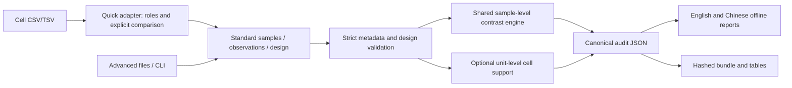

# Unified BatchLens architecture

`quick.py` adapts input; it contains no estimability implementation. `design.py` retains the original additive fixed-effects matrix and contrast logic. `coverage.py` pools cells by declared unit, target and cell type without changing matrix rows. `audit.py` combines findings with evidence pointers. `service.py` is the shared orchestration boundary used by web, desktop and CLI.

`localization.py` translates presentation only. Canonical JSON preserves English rule IDs/text and numeric evidence. Jinja autoescapes both report languages. `reporting.py` stages a complete bundle, reserves a new destination and writes COMPLETE last; it never replaces old reports or recursively deletes staging folders.

The browser is packaged static HTML/CSS/JavaScript, with no framework, remote assets or storage of study data. The loopback HTTP service checks a session capability, Host/Origin and request bounds, and serializes audits. Uploads remain in memory. Native pywebview wraps the same interface; PyInstaller includes Python and package resources.

Why: one engine avoids divergent scientific answers and duplicate maintenance. A lightweight adapter reduces initial setup while preserving explicit study declarations. Plain packaged assets keep offline desktop delivery practical. Scientific runtime dependencies are unchanged; Playwright is a development-only browser test dependency.
